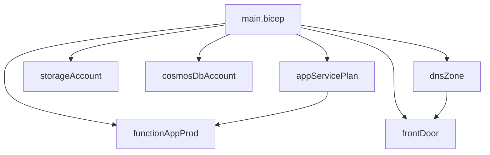

# Azure Bicep Modules

This directory contains reusable Bicep modules for Azure resource deployment. Each module is designed to be self-contained and configurable through parameters.

## Module Overview

### appServicePlan.bicep
Deploys an App Service Plan for hosting Function Apps.
- **Key Parameters**:
  - `appServicePlanName`: Name of the App Service Plan
  - `skuName`: SKU name for the plan
  - `skuTier`: SKU tier (Free to Isolated)
  - `osType`: Operating system type (Windows/Linux)

### storageAccount.bicep
Deploys a Storage Account with comprehensive security settings.
- **Key Features**:
  - Enforced HTTPS
  - TLS 1.2 minimum version
  - Blob, File, Queue, and Table services
  - Function-specific containers
  - OAuth authentication

### cosmosDbAccount.bicep
Deploys a Cosmos DB account with SQL API.
- **Key Features**:
  - Serverless capability
  - Periodic backup policy
  - Configurable consistency level
  - Database and container creation

### dnsZone.bicep
Manages DNS zone and record sets.
- **Supported Records**:
  - A Records
  - CNAME Records
  - TXT Records (for domain verification)
  - Front Door endpoint integration

### functionAppProd.bicep
Deploys a production Function App with staging slot.
- **Key Features**:
  - Linux-based
  - .NET 8.0 runtime
  - CORS configuration
  - HTTPS-only access
  - Staging slot included

### frontDoor.bicep
Deploys Azure Front Door profile with custom domain support.
- **Key Features**:
  - Managed TLS certificate
  - Custom domain integration
  - DNS zone integration
  - Global endpoint deployment

## Module Dependencies



## Security Considerations

Each module implements Azure security best practices:
- TLS 1.2 minimum version
- HTTPS enforcement
- OAuth authentication where applicable
- Managed identities for authentication
- Network security rules
- Encryption at rest and in transit

## Parameter Validation

Modules implement parameter validation through:
- Allowed value constraints
- Description annotations
- Default values where appropriate
- Required vs optional parameters

## Best Practices

When using these modules:
1. Always review parameter values before deployment
2. Use resource naming that follows your organization's conventions
3. Apply appropriate tags for resource management
4. Consider regional availability for resource types
5. Review access policies and network rules

## Module Usage Example

```bicep
module appServicePlan 'modules/appServicePlan.bicep' = {
  name: 'appServicePlan'
  params: {
    appServicePlanName: 'asp-prod-001'
    location: location
    skuName: 'P1v2'
    skuTier: 'PremiumV2'
    osType: 'Linux'
    tags: tags
  }
}
```
